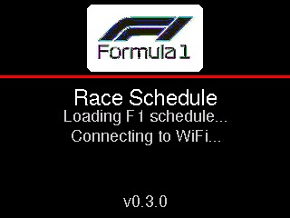
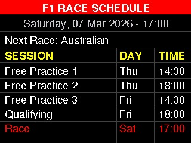
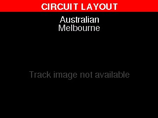

# F1 CYD Notifications

F1 race-week display and notification firmware for the **ESP32-2432S028R (Cheap Yellow Display)**.

The device shows upcoming F1 sessions, race-week countdown, and post-race data on the 320x240 TFT, with optional Telegram alerts and a local web UI for configuration + OTA updates.

## What It Does

- Connects to Wi-Fi with captive portal onboarding (WiFiManager)
- Syncs NTP time using configurable timezone (IANA format)
- Fetches 2026 F1 schedule from Sportstimes JSON
- Displays rotating race-week and post-race screens on TFT
- Polls post-race results/standings from Jolpica API
- Sends Telegram notifications (race week, pre-session, result)
- Serves local config/status UI and OTA firmware update page
- Captures live TFT screenshots to MicroSD as BMP files

## Hardware

- Board: ESP32-2432S028R (2.8" ILI9341 touch TFT)
- Display: 320x240 landscape
- Touch: TFT_eSPI touch controller
- Backlight: PWM on `PIN_BL`
- RGB LED: active-low status LED
- LDR: optional auto-brightness input

Pins and display constants are defined in [include/config.h](./include/config.h).

## Software Stack

- PlatformIO + Arduino framework
- `TFT_eSPI`
- `ArduinoJson`
- `WiFiManager`
- `UniversalTelegramBot`
- `ESPAsyncWebServer` + `AsyncTCP`
- `ElegantOTA`
- `ezTime`

Project configuration: [platformio.ini](./platformio.ini)

## Quick Start

### 1. Build

```bash
pio run
```

### 2. Upload firmware

```bash
pio run -t upload
```

### 3. Upload LittleFS (if needed)

```bash
pio run -t uploadfs
```

### 4. Open serial monitor

```bash
pio device monitor -b 115200
```

## First Boot and Setup

1. Device starts WiFiManager portal AP: `F1-Display`
2. Connect and provide Wi-Fi credentials
3. Optionally set timezone + Telegram token/chat in portal
4. Device re-joins network and prints IP on serial
5. Open `http://<device-ip>/` for full config UI

## TFT Screens

Captured from the device TFT output.

### Startup 



### Race Week Countdown


### Race Schedule



### Circuit Layout



## Display State Flow

```text
IDLE (countdown)
  └─ when first session is within 7 days
      └─ RACE_WEEK_COUNTDOWN -> RACE_WEEK_SCHEDULE -> RACE_WEEK_TRACK (8s rotation)
          └─ after GP start time
              └─ POST_RACE_WINNER -> POST_RACE_DRIVERS -> POST_RACE_CONSTRUCTORS (10s rotation)
                  └─ exits after 7-day post-race window
                      └─ back to IDLE
```

Touch input manually advances to the next state in the active phase.

## Functional Operation

### Startup sequence

1. Init display
2. Init screenshot capture (SD + optional button trigger)
3. Draw splash screen
4. Init LED status
5. Mount LittleFS + load config
6. Apply brightness
7. Connect Wi-Fi
8. Sync time
9. Fetch schedule (fallback to cache)
10. Init Telegram (if enabled)
11. Start web server + OTA
12. Init touch and enter main loop

### Main loop periodic tasks

- `events()` for ezTime maintenance
- Touch polling for manual screen advance
- Display render/update state machine
- Notifications check every **60s**
- Post-race results polling every **30m** (active window only)
- Schedule refresh every **24h**
- Brightness update every **10s**
- ElegantOTA loop handler

### Data sources

- Schedule: `https://raw.githubusercontent.com/sportstimes/f1/main/_db/f1/2026.json`
- Results/standings: `http://api.jolpi.ca/ergast/f1/2026`

## Telegram Notifications

Enabled when bot token + chat ID are configured.

Notification types:

- Race week notification (Monday in race-week window)
- Pre-session notification (1 hour before):
  - Sprint Qualifying
  - Sprint
  - Qualifying
  - Race
- Race result notification after data becomes available

Duplicate suppression is handled with per-round bitmask persistence in config.

## Web UI and API

Base URL: `http://<device-ip>/`

- `GET /` config + schedule UI
- `GET /update` OTA page
- `GET /api/config` current config JSON
- `POST /api/config` update config
- `GET /api/status` heap/uptime/IP
- `GET /api/schedule` current race sessions
- `GET /api/races` upcoming rounds list
- `GET /api/debug` get debug level
- `POST /api/debug` set debug level (0..4)
- `POST /api/screenshot` queue TFT screenshot capture to MicroSD

## Screenshot Capture (MicroSD)

The project includes a portable screenshot module in:
- `include/screenshot_capture.h`

What it does:
- Captures the current 320x240 TFT frame at runtime
- Saves 24-bit BMP images to MicroSD in `SCREENSHOT_DIR` (default `/shots`)
- Uses request-queue flow so web/button triggers execute safely in `loop()`

Trigger options:
- Web UI button: **Capture TFT Screenshot**
- Web API: `POST /api/screenshot`
- Optional physical button (active LOW, `INPUT_PULLUP`) on `PIN_SHOT_BTN`

Physical switch wiring (example):

```text
ESP32-2432S028R (CYD)

   GPIO27 (PIN_SHOT_BTN) o------.
                                |
                           [ Momentary
                             Pushbutton ]
                                |
   GND -------------------------'

Optional: use GPIO22 instead by changing PIN_SHOT_BTN in config.h
```

Config flags in `include/config.h`:
- `PIN_SD_CS` (default `5`)
- `PIN_SHOT_BTN` (default `27`)
- `SCREENSHOT_WEB_ENABLED` (`1` enabled)
- `SCREENSHOT_BUTTON_ENABLED` (`0` disabled by default)
- `SCREENSHOT_DEBOUNCE_MS`
- `SCREENSHOT_DIR`

Output files:
- Synced time: `/shots/shot_YYYYMMDD_HHMMSS.bmp` (user timezone)
- Unsynced early boot fallback: `/shots/shot_unsynced_XXXXXX.bmp`

## Configuration Storage

LittleFS files:

- `/config.json` user settings + notification state
- `/races.json` cached schedule payload
- `/results.json` reserved helper cache (not active in current flow)

Config keys:

- `tz`, `ntp`, `bot`, `chat`, `bright`, `notRound`, `notBits`, `tgOn`

## Logging and Debug

Runtime debug levels:

- `0` Off
- `1` Error
- `2` Warn
- `3` Info (default)
- `4` Verbose

Change at runtime from web UI or `/api/debug`.

## Known Limitations

- Track image lookup is placeholder unless track assets are implemented in `include/track_images.h`
- Season URLs are hardcoded to **2026**
- Web UI/API and OTA are unauthenticated on local network
- Some network clients currently use insecure TLS mode

## Project Structure

- `src/main.cpp` main setup/loop orchestration
- `include/display_renderer.h` TFT drawing functions
- `include/display_states.h` display phase/state machine
- `include/f1_data.h` schedule/results fetch + parse
- `include/telegram_handler.h` notification logic
- `include/web_server.h` local web UI + API + OTA
- `include/config_manager.h` LittleFS config/cache I/O
- `include/time_utils.h` NTP/timezone/countdown helpers

## Related Docs

- Functional/operational detail: [FUNCTIONAL_OPERATIONAL_SPEC.md](./FUNCTIONAL_OPERATIONAL_SPEC.md)
- Change history: [CHANGELOG.md](./CHANGELOG.md)
- Project notes: [CLAUDE.md](./CLAUDE.md)
